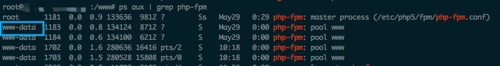
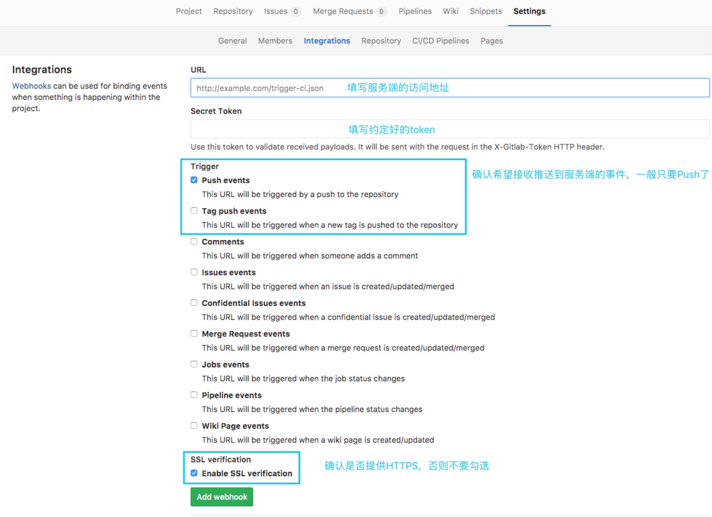
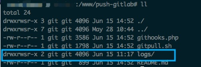
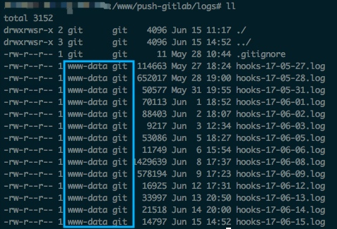

# 使用Gitlab Webhooks自动部署代码

[TOC]

### 为什么要用Webhooks来更新代码

* 服务端的代码，不希望直接在服务器上面做更改，需要有中央仓库做托管管理，也利于协作
* 某些情况下，不希望给开发人员服务器ssh登录权限
* 开发时，希望得到更快的上线部署速度，享受git commit & git push & refresh的快感

### Webhooks部署时需要考虑的一些因素

* 现有github，gitlab，oschina等一些托管基本都支持Webhooks，原理都是利用[git hooks][1]来做的拓展
* 什么情况下需要更新代码？根据commit message？根据branch?
* 更新代码时的执行身份？由什么用户来执行git？

### 设置Linux服务器

1. 前提：当前已经登录root用户或者具有sudo权限的用户
2. 确认即将用于执行git命令的用户，假定我们新增一个用户名`git`，专门用于跑git命令，那么执行 `sudo adduser git`，并设置密码
3. 接下来，将`git`用户添加到sudo组：`sudo adduser git sudo`[此步骤非必须]
4. 假定项目代码放在`/www`下面，且Owner是git，那么执行`sudo mkdir /www && sudo chown -R git:git /www`
5. 由于我们的Webhooks代码是用Nginx + PHP-FPM部署的，那么确认下PHP脚本的运行用户情况：`ps aux | grep php-fpm`， 确认`www-data`为我们的运行用户

6. 将`www-data`加到`git`用户组：`sudo usermod -aG git www-data`
7. 给`www-data`用户不需要密码就能切换到`git`用户，并且用git用户的身份执行`/usr/bin/git`命令，修改sudoers：`sudo vim /etc/sudoers`，添加一行配置：`www-data ALL=(git) NOPASSWD: /usr/bin/git`
8. 允许同组用户新增文件时继承原有文件夹权限位：`sudo chmod -R g+s /www`[此步骤非必须]
9. 由于我们希望无密码自动拉取代码，那么gitlab代码也是使用ssh方式来配置连接方式的，且hooks被触发时是通过`www-data`切换成`git`用户来执行`/usr/bin/git`命令，那么实际上`git pull`等命令使用的SSH key是`git`用户的SSH key，确保已经将`git`用户的`/home/git/.ssh/id_rsa.pub`文件的内容设置到gitlab项目中

### 实现Webhooks项目的代码

* 请参考[gitlab-php-webhooks][2]，具体逻辑请看代码注释

* 设置gitlab的Webhooks



* 项目文件夹权限设置：



* 项目生成的日志文件权限情况：



* nginx配置参考

```
server {
    listen 80;

    root /www/push-gitlab;
    index index.php index.html index.htm;

    server_name gitlab.server.com;

    #location ~ \.php$ {
    location = /githooks.php {
        fastcgi_split_path_info ^(.+\.php)(/.+)$;
        fastcgi_param SCRIPT_FILENAME $document_root$fastcgi_script_name;
        fastcgi_pass unix:/var/run/php5-fpm.sock;
        include fastcgi_params;
    }

    # rewrite请求参数，不直接暴露服务器文件路径
    if (!-e $request_filename) {
        rewrite /checkout/(.*)$ /githooks.php?name=$1 last;
        break;
    }

}

```

[1]: https://git-scm.com/book/zh/v2/%E8%87%AA%E5%AE%9A%E4%B9%89-Git-Git-%E9%92%A9%E5%AD%90
[2]: https://github.com/CsHeng/gitlab-php-webhooks


